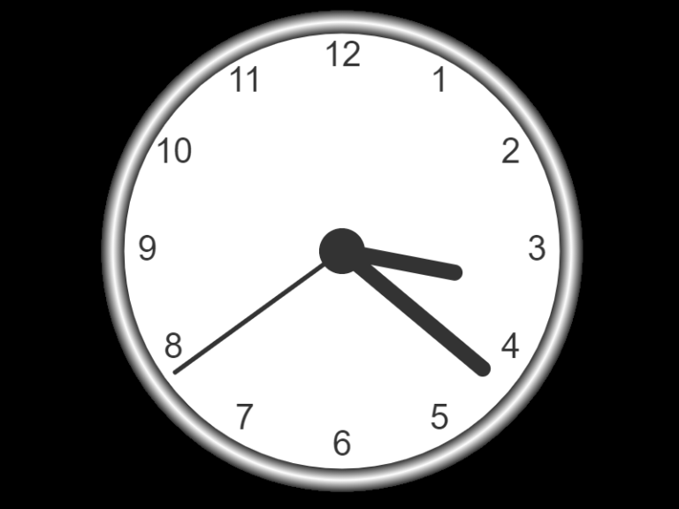

# Analogue Clock

# What You Should See
Clock should display a working analogue time in your local time zone.

# Project Objective
The objective of this JavaScript Project is to wire up analogue JavaScript Clock.

# JavaScript Used
* JavaScript Canvas Web API

# Level of Difficulty
This project is more about knowing how to manipulate the [JavaScript Canvas Web API](https://developer.mozilla.org/en-US/docs/Web/API/Canvas_API) than using core JavaScript itself.

I found code easy to read but the project hard in practice to implement.

In fact, although I can follow the “why” behind the syntax of this project, it would take me quite a long time to implement the code myself.

I used this project more as a code along than a do-it-yourself.

As the solution was presented, I copied the code and then studied it.

If I had to write this code myself from scratch, I'd have a very difficult time.

You have to not only know how to use the Canvas API, but also how to use math to manipulate the positioning of many elements in the project.

For example, here is the loop used to position all of the numbers on the clock:

# New Things Learned or Refreshed
I learnt to use of the JavaScript Canvas API.